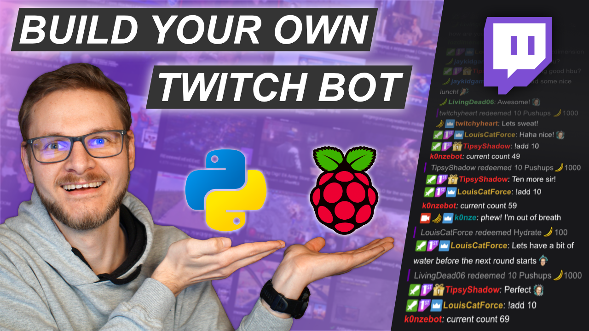
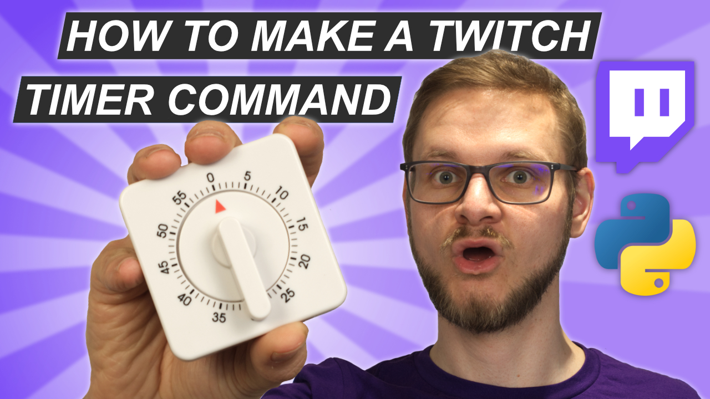

# Twitch Count Bot 

Simple Twitch bot (forked from: [Twitch Count Bot](https://github.com/k0nze/twitch_count_bot)) which sets a timer and replies with `!timeralert` when the time is up:

 * `!settimer ([0-9]+(s|m|h))+`: sets a timer for a given time (e.g. `!settimer 1h 10m` will set a timer for 1 hour and 10 minutes).

## Setup Videos
<a href="https://youtu.be/CPVSoowZhVw">
    
</a>

[Youtube Video Link](https://youtu.be/CPVSoowZhVw)


<a href="https://youtu.be/7cK-uAjTOdU">
    
</a>

[Youtube Video Link](https://youtu.be/7cK-uAjTOdU)

## Setup and Run

Requires Python `3.7.3`.

Install necessary packages (locally):

```bash
python3 -m pip install -r requirements.txt
```

Copy `.env.sample` to `.env`

```
cp .env.sample .env

```

Open `.env` and insert the following fields:

| Field        | Explanation                                                           |
|--------------|-----------------------------------------------------------------------|
| `TMI_TOKEN`  | OAuth Token with `oauth:` as a prefix                                 |
| `CLIENT_ID`  | Client ID obtained from Twitch's Developer site                       |
| `BOT_NICK`   | Twitch name of the Bot                                                | 
| `BOT_PREFIX` | Prefix for commands the bot should listen to (set to `!` per default) |
| `CHANNEL`    | The name of the your Twitch channel you want the bot to run at        |

Start Bot:

```
python3 bot.py
```

## Credits
 Created by Konstantin (Konze) Lübeck

 * Discord: [discord.k0nze.gg](https://discord.k0nze.gg) 
 * Twitch: [twitch.tv/k0nze](https://twitch.tv/k0nze) 
 * Youtube: [youtube.com/k0nze](https://youtube.com/k0nze) 
 * Twitter: [twitter.com/k0nze_gg](https://twitter.com/k0nze_gg) 
 * Instagram: [instagram.com/k0nze.gg](https://instagram.com/k0nze.gg) 
